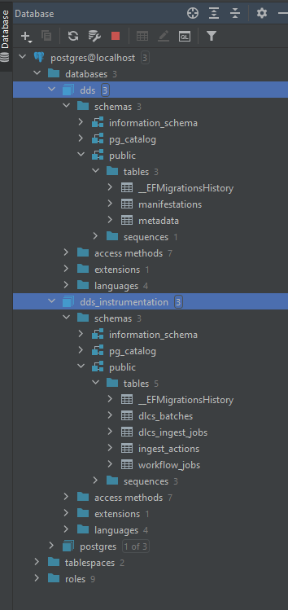

# Getting started

You need:

* [AWS CLI v2](https://docs.aws.amazon.com/cli/latest/userguide/install-cliv2.html) installed
* [.NET Framework](https://dotnet.microsoft.com/download) SDK 5.x installed (latest version of .NET 5)
* A WellcomeCloud account (name@Wellcomecloud.onmicrosoft.com) that has the necessary AWS permissions. This allows you to log in to the AWS console via the wellcomecloud.org portal (Azure Active Directory).
* (Optional) The AWS Extend Switch Roles plugin for Chrome, for easily switching roles in the Console
* (Optional) a .NET IDE such as Rider or Visual Studio 2019. You can use any text editor, though.
* _Either_ a locally running PostgreSQL 12.5, or a working connection to an AWS RDS instance (e.g., via SSH). This guide uses a _local_ PostgreSQL.
* 4 appSettings.Development.json files, one for each of the four applications in iiif-builder. You need to ask someone to give you these! These are excluded from source control. 
* [aws-azure-login](https://github.com/sportradar/aws-azure-login). This lets you (and .NET) acquire temporary credentials to assume roles and run against AWS. Follow the instructions in the README. You are _strongly_ recommended to use the `--mode gui` option which is much friendlier for daily use. 

You need the following in your ~/.aws credentials file:

```
[wcdev]
region=eu-west-1
role_arn=arn:aws:iam::653428163053:role/digirati-developer
source_profile=wellcome-az

[wcstorage]
region=eu-west-1
role_arn=arn:aws:iam::975596993436:role/storage-read_only
source_profile=wellcome-az
```

After running the configuration command for aws-azure-login, you should end up with something like this in your .aws/config file:

```
[profile wellcome-az]
azure_tenant_id=(get this from Wellcome)
azure_app_id_uri=(get this from Wellcome)
azure_default_username=t.crane@wellcomecloud.onmicrosoft.com
azure_default_role_arn=arn:aws:iam::653428163053:role/digirati-developer
azure_default_duration_hours=1
azure_default_remember_me=true
```

Typically you refresh your AWS credentials like this: 

`aws-azure-login --profile wellcome-az --mode gui`. 

Always specify 1 hr, as Wellcome AWS won't let you have longer. 

* Clone the iiif-builder repository

Build the solution:

`..\src\Wellcome.Dds> dotnet build`

* Create your local PostgreSQL DBs, if you're not using the remote ones. You will first need to modify their PostreSQL connection strings for your database in the appSettings.Development.json files (Wellcome.Dds.Dashboard is essential, before running the following commands).

If you need to create local DBs, the EF migrations for DdsInstrumentationContext live in Wellcome.Dds.AssetDomainRepositories, the EF migrations for DdsContext live in Wellcome.Dds.Repositories, and the `Startup` project is Wellcome.Dds.Dashboard.

in ..\src\Wellcome.Dds:

```
> dotnet tool install --global dotnet-ef   # (if not already installed)
> dotnet ef database update -p .\Wellcome.Dds.Repositories\ -s .\Wellcome.Dds.Dashboard\ --context DdsContext
> dotnet ef database update -p .\Wellcome.Dds.AssetDomainRepositories\ -s .\Wellcome.Dds.Dashboard\ --context DdsInstrumentationContext
```

This should create the Dds and DdsInstrumentation databases. For example, after running these, local PostgreSQL has:



In your appSettings.Development.json for Wellcome.Dds.Dashboard, ensure that the `Storage` section is configured for _Production_ storage (this means Wellcome's production preservation platform). Most development is done against production storage, staging DDS. This combination is called "test" and is the same configuration deployed at iiif-test.wellcomecollection.org.

Now try running the dashboard:

```
c:\git\wellcomecollection\iiif-builder\src\Wellcome.Dds\Wellcome.Dds.Dashboard> dotnet run
```

Initial try without a local https cert:

visit localhost:8085/dash/ in your browser. You will need to log in with your wellcomecloud account.
Once on the dashboard home page, visit http://localhost:8085/dash/Manifestation/b19955078

(There's nothing special about this b-number, it's just an example!)

You should see a list of pages for the digitised book.


